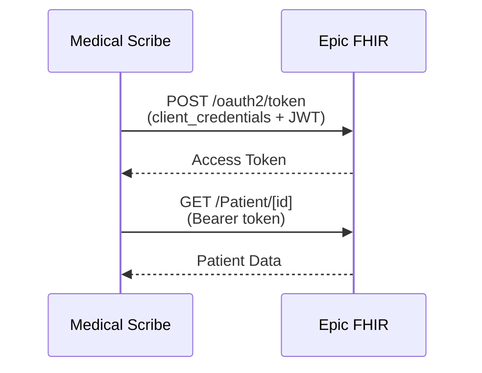

# Epic Integration Setup Guide

## Prerequisites

You already have an Epic app registered (appId=41948). You'll need to configure it properly and connect it to the Medical Scribe application.

## Step 1: Epic App Configuration

### Required Epic App Settings

1. **App Type**: Backend Service (for server-to-server communication)

2. **OAuth2 Grant Type**: 
   - ✅ Client Credentials (Backend OAuth2)
   - ✅ JWT Bearer (if using signed assertions)

3. **FHIR Version**: R4 (recommended) or DSTU2

4. **Required Scopes** - Request these in your Epic app:
   ```
   system/Patient.read
   system/Patient.search
   system/Encounter.read
   system/Encounter.search
   system/Observation.read
   system/Condition.read
   system/MedicationRequest.read
   system/AllergyIntolerance.read
   system/Immunization.read
   system/DocumentReference.read
   ```

5. **Redirect URIs** (if using SMART on FHIR):
   ```
   http://localhost:3000/auth/epic/callback
   https://your-domain.com/auth/epic/callback
   ```

## Step 2: Gather Required Information

From your Epic app dashboard, collect:

1. **Client ID**: Your app's client ID
2. **Client Secret**: Backend OAuth2 secret (keep secure!)
3. **Epic Environment URLs**:
   - Sandbox: `https://fhir.epic.com/interconnect-fhir-oauth/api/FHIR/R4`
   - Production: Organization-specific URL

4. **Private Key** (if using JWT Bearer):
   - Generate RSA key pair
   - Upload public key to Epic
   - Keep private key secure

## Step 3: Configure Medical Scribe Application

### Option A: Using the API

```bash
curl -X POST http://localhost:8000/api/ehr/connections \
  -H "Authorization: Bearer YOUR_JWT_TOKEN" \
  -H "Content-Type: application/json" \
  -d '{
    "organization_id": "your-org-id",
    "organization_name": "Your Healthcare Organization",
    "ehr_system": "epic",
    "base_url": "https://fhir.epic.com/interconnect-fhir-oauth",
    "api_version": "R4",
    "client_id": "YOUR_EPIC_CLIENT_ID",
    "client_secret": "YOUR_EPIC_CLIENT_SECRET",
    "is_sandbox": true,
    "rate_limit_per_minute": 100
  }'
```

### Option B: Using Environment Variables

Add to your `.env` file:

```env
# Epic Configuration
EPIC_CLIENT_ID=your_client_id_here
EPIC_CLIENT_SECRET=your_client_secret_here
EPIC_BASE_URL=https://fhir.epic.com/interconnect-fhir-oauth
EPIC_PRIVATE_KEY_PATH=/path/to/private_key.pem
```

## Step 4: Test the Connection

1. **Test Authentication**:
```bash
curl -X POST http://localhost:8000/api/ehr/connections/CONNECTION_ID/test \
  -H "Authorization: Bearer YOUR_JWT_TOKEN"
```

2. **Search for a Test Patient**:
```bash
curl -X POST http://localhost:8000/api/ehr/search/patients \
  -H "Authorization: Bearer YOUR_JWT_TOKEN" \
  -H "Content-Type: application/json" \
  -d '{
    "organization_id": "your-org-id",
    "last_name": "Argonaut",
    "first_name": "Jason"
  }'
```

## Step 5: Epic-Specific Considerations

### 1. Patient Context

Epic uses specific test patients in sandbox:
- Jason Argonaut (Patient ID: Tbt3KuCY0B5PSrJvCu2j-PlK.aiHsu2xUjUM8bWpetXoB)
- Jessica Argonaut
- James Argonaut

### 2. Rate Limits

Epic enforces rate limits:
- Sandbox: 10 requests/second, 1000 requests/day
- Production: Varies by organization

### 3. Data Availability

In sandbox, not all data types may be available. Test with:
- Patient demographics ✓
- Encounters ✓
- Medications ✓
- Allergies ✓
- Conditions ✓
- Observations (vitals, labs) ✓

### 4. Authentication Flow



## Step 6: Production Deployment

### 1. Epic App Orchard Certification

Before going to production:
1. Complete Epic's security assessment
2. Pass interoperability testing
3. Get approval for production access

### 2. Organization-Specific Setup

Each healthcare organization needs:
1. Their Epic FHIR endpoint URL
2. Organization-specific client credentials
3. Network connectivity (VPN/firewall rules)

### 3. Security Requirements

- **TLS 1.2+** for all connections
- **Encrypted storage** for credentials
- **Audit logging** for all API calls
- **PHI handling** compliance

## Troubleshooting

### Common Issues

1. **401 Unauthorized**
   - Check client credentials
   - Verify JWT signature (if using JWT Bearer)
   - Ensure token hasn't expired

2. **403 Forbidden**
   - Verify requested scopes are approved
   - Check organization permissions

3. **404 Not Found**
   - Verify base URL is correct
   - Check patient/resource IDs

4. **429 Too Many Requests**
   - Implement exponential backoff
   - Check rate limit configuration

### Debug Mode

Enable debug logging:
```python
# In your backend code
import logging
logging.getLogger('app.integrations.epic_connector').setLevel(logging.DEBUG)
```

## Integration Features

Once connected, you can:

1. **Search Patients**
   - By name, DOB, MRN
   - Bulk import capabilities

2. **Sync Patient Data**
   - Demographics
   - Active medications
   - Allergies & intolerances
   - Problem list
   - Recent vitals
   - Immunizations

3. **Real-time Updates**
   - Pull latest vitals during encounters
   - Refresh patient data on demand

4. **Historical Data**
   - Retrieve past encounters
   - Access historical lab results
   - View medication history

## Best Practices

1. **Caching**: Cache patient data with appropriate TTL
2. **Batch Operations**: Use FHIR batch/transaction when possible
3. **Error Handling**: Implement robust retry logic
4. **Monitoring**: Track API usage and response times
5. **Updates**: Subscribe to Epic's developer notifications

## Support Resources

- Epic Developer Portal: https://fhir.epic.com
- Epic Community: https://galaxy.epic.com
- Technical Documentation: https://fhir.epic.com/Documentation
- Sandbox Testing: https://fhir.epic.com/Documentation?docId=testpatients

## Next Steps

1. Complete Epic app configuration
2. Test in sandbox environment
3. Implement organization-specific connections
4. Plan for App Orchard certification
5. Deploy to production

Remember to keep your credentials secure and never commit them to version control!